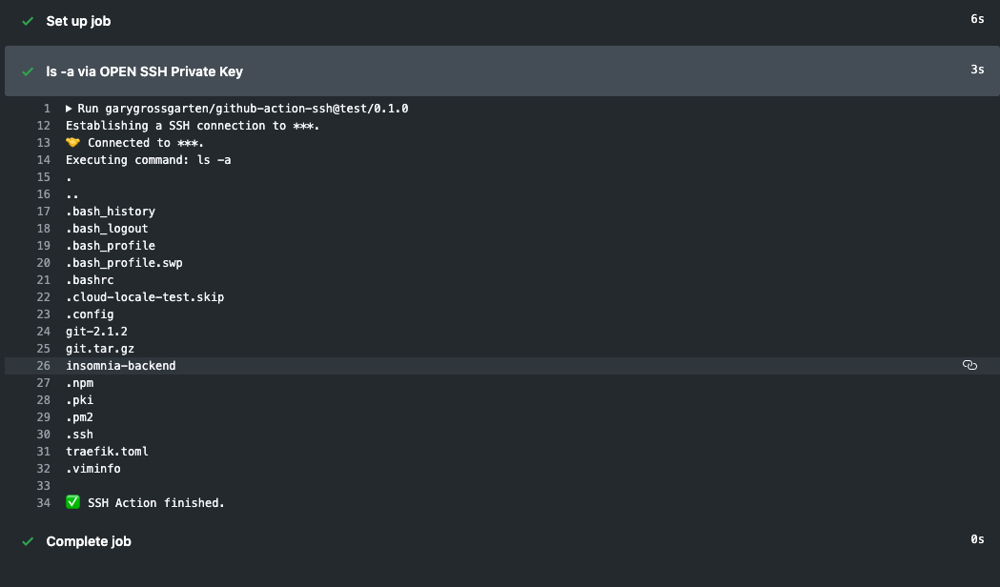

# GitHub Action SSH

Simple GitHub Action to run a command on a remote server using SSH. This is working with the latest [GitHub Actions](https://github.com/features/actions).

## ✨ Example Usage

**Example using OpenSSH encrypted private key**

```yml
- name: ls -a via ssh
  uses: garygrossgarten/github-action-ssh@release
  with:
    command: ls -a
    host: ${{ secrets.HOST }}
    username: garygrossgarten
    passphrase: ${{ secrets.PASSPHRASE }}
    privateKey: ${{ secrets.PRIVATE_KEY}}
```

🔐 Set your secrets here: `https://github.com/USERNAME/REPO/settings/secrets`.

Check out [the workflow example](.github/workflows/ssh-example-workflow.yml) for a minimalistic yaml workflow in GitHub Actions.

**Result**



## Options

- **host** - _string_ - Hostname or IP address of the server. **Default:** `'localhost'`

- **port** - _integer_ - Port number of the server. **Default:** `22`

- **username** - _string_ - Username for authentication. **Default:** (none)

- **password** - _string_ - Password for password-based user authentication. **Default:** (none)

- **privateKey** - _mixed_ - _Buffer_ or _string_ that contains a private key for either key-based or hostbased user authentication (OpenSSH format). **Default:** (none)

- **passphrase** - _string_ - For an encrypted private key, this is the passphrase used to decrypt it. **Default:** (none)

- **tryKeyboard** - _boolean_ - Try keyboard-interactive user authentication if primary user authentication method fails. **Default:** `false`

## Development

---

This thing is build using Typescript and
[ssh2](https://github.com/mscdex/ssh2) (via [node-ssh](https://github.com/steelbrain/node-ssh)). 🚀
